# 课程依赖图与排课规则

## 1. 依赖图

```mermaid
flowchart TD
    A[Java 线程与集合] --> B[JMM 与并发安全]
    B --> C[MySQL 数据与事务]
    C --> D[Spring 事务与代理]
    D --> E[Redis 缓存/限流/幂等]
    D --> F[Kafka/Outbox]
    E --> G[重试/DLT/对账/恢复]
    F --> G
    G --> H[可观测性/压测/故障注入]
    H --> I[JVM/GC/JFR 排障]
    H --> J[网络/连接池/超时]
    I --> K[Docker 与部署]
    J --> K
    K --> L[Kubernetes 入门]
    L --> M[多实例/多机分布式]
    C --> N[LLM/RAG 基础]
    N --> R[文档 ingestion]
    R --> S[混合检索/向量数据库]
    S --> T[RAG 评测/引用/安全]
    H --> O[Agent 事故助手边界]
    T --> P[Tool/Memory/Agent Runtime]
    G --> O
    P --> M
    M --> Q[系统设计/简历/项目答辩]
    O --> Q
```



图中的箭头表示“能解释后者的关键机制”，不是必须把前一章所有题目做完才能阅读后一章。发布门槛仍由真实实验和作业决定。

## 2. 章节映射

| 层 | 章节 | 学习者必须能回答的问题 |
|---|---|---|
| Java 基础 | 01-04 | 如何保证并发正确性？数据如何落盘、索引和领取？ |
| 可靠后端 | 05-08 | 事务、缓存、消息和恢复如何组合而不丢数据/重复副作用？ |
| 证据工程 | 09-11 | 如何用指标、压测、JFR、网络和连接池证明系统有效？ |
| 平台与设计 | 12-13 | 如何把服务打包、发布、回滚，并完成系统设计与项目答辩？ |
| AI 后端 | 14-18 | 模型、检索、工具和 Agent 如何做到可评测、可审计、可恢复？ |
| 分布式求职 | 19-23 | 如何把机制、证据和取舍讲成系统设计与简历项目？ |

## 3. 每层入口与出口

### Java 基础层

入口：能读 Java 代码并运行 JDK 21。

出口：完成并发、集合、JMM、MySQL 四章实验；能解释线程池拒绝、可见性、索引与锁。

### 可靠后端层

入口：理解事务和基本 SQL。

出口：NotifyFlow 能完成任务创建、Outbox 发布、消费幂等、重试预算、UNKNOWN 对账和恢复审计设计。

### 证据工程层

入口：完成可靠主链路设计。

出口：能定义 SLI/SLO、写开放/封闭负载、解释 P99/队列/拒绝、采集 JFR，并给出数据正确性证据。

### 平台工程层

入口：知道服务依赖、端口、配置和健康检查。

出口：能写 Dockerfile/Compose，解释容器隔离；能用 Kubernetes 完成部署、探针、滚动发布、回滚和故障定位。

### AI 后端层

入口：会调用一个模型 API，并理解 HTTP/JSON。

出口：能解释 Transformer 和推理瓶颈，完成可追踪 ingestion、混合检索与向量索引，建立带引用和安全门禁的 RAG 评测，并设计受权限和幂等控制的 Tool/Agent Runtime。

### 求职发布层

入口：至少一个真实项目证据包。

出口：一页简历、五分钟项目介绍、十五分钟技术试讲、系统设计图和可追溯事实台账。

## 4. 排课规则

1. 每周最多推进一个主难点，避免同时引入数据库、消息和 Agent 新概念。
2. 先做零依赖或已有环境实验，再做 Docker/Maven/外部服务实验。
3. 任何章节进入下一层前，至少完成一次 Teach-back；实验 Pending 时只能标记 Draft。
4. Agent 章节必须引用 Java 后端已有的幂等、权限、审计、超时和可观测性机制。
5. Docker/Kubernetes 不作为“部署按钮”教学，必须解释进程、网络、资源和故障边界。
6. 多机分布式题目必须先写单机状态机，再扩展到租约、分片、幂等和恢复。

## 5. 依赖缺口追踪

| 缺口 | 影响 | 当前处理 |
|---|---|---|
| Maven 精确版本下载权限 | Micrometer/Spring 真实运行 | 保留实现与测试，状态 Pending |
| k6 未安装 | 真实开放负载和 threshold | 脚本已静态检查，运行 Pending |
| Docker Engine 未启动 | Redis/Kafka/Compose 运行 | 保留静态证据，等待用户启动 |
| 学习者未完成试讲 | 课程不能 Released | 记录为 Teach Pending |
| 第 10-19 章实验与学习验证不足 | V0.2/V0.3/V0.4 未达成 | 按依赖图补运行证据、作业与 Teach-back |

## 6. 复习路径

面试前时间有限时，按以下路径压缩：

```text
01 -> 03 -> 04 -> 05 -> 07 -> 08 -> 09 -> 10 -> 12 -> 14 -> 15 -> 16 -> 17 -> 18 -> 22
```

每个节点必须留下一个“我能教会别人”的输出：机制图、实验结果、故障时间线或项目答辩稿。
